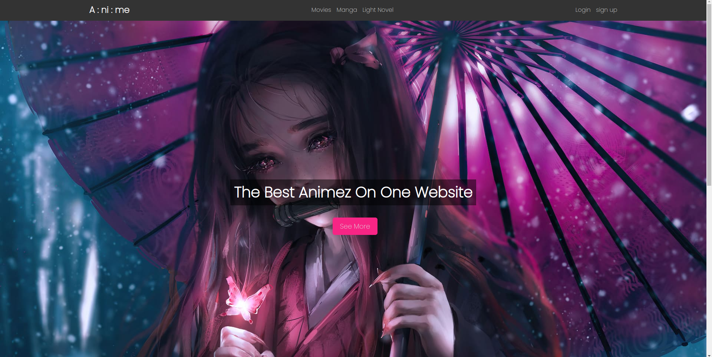

# Anime Landing Page

The Anime Landing Page is a visually appealing website designed to showcase and provide information about various anime series. It features a modern and immersive design, intuitive navigation, and engaging content.

## Features

- **Responsive Design**: The landing page is designed to be fully responsive, providing an optimal viewing experience across different devices and screen sizes.

- **Navigation**: The navigation menu allows users to easily explore different sections of the website, including movies, manga, and light novels. Users can also access the login and sign-up pages.

- **Featured Section**: The landing page includes a visually appealing "intro" section featuring a captivating background image, a prominent title, and a call-to-action button to explore more content.

- **Anime Cards**: A section called "cards" displays attractive cards representing different anime series. Each card includes an image and a brief description, enticing users to click and learn more about each series.

- **Footer**: The footer section contains information about the developer and includes a link to their GitHub profile.

## Technologies Used

The Anime Landing Page is built using the following technologies:

- HTML
- CSS

## Usage

To use or deploy the Anime Landing Page, follow these steps:

1. Clone the repository: `git clone https://github.com/nisha5155/Anime-Landing-Page.git`
2. Navigate to the project directory: `cd Anime-Landing-Page`
3. Open `index.html` in your preferred web browser.

## Screenshots

Here are some screenshots of the landing page to showcase its design and features.

 

## License

This project is licensed under the [MIT License](LICENSE).

## Acknowledgements

- Background images sourced from Unsplash.
- Fonts used from Google Fonts.

